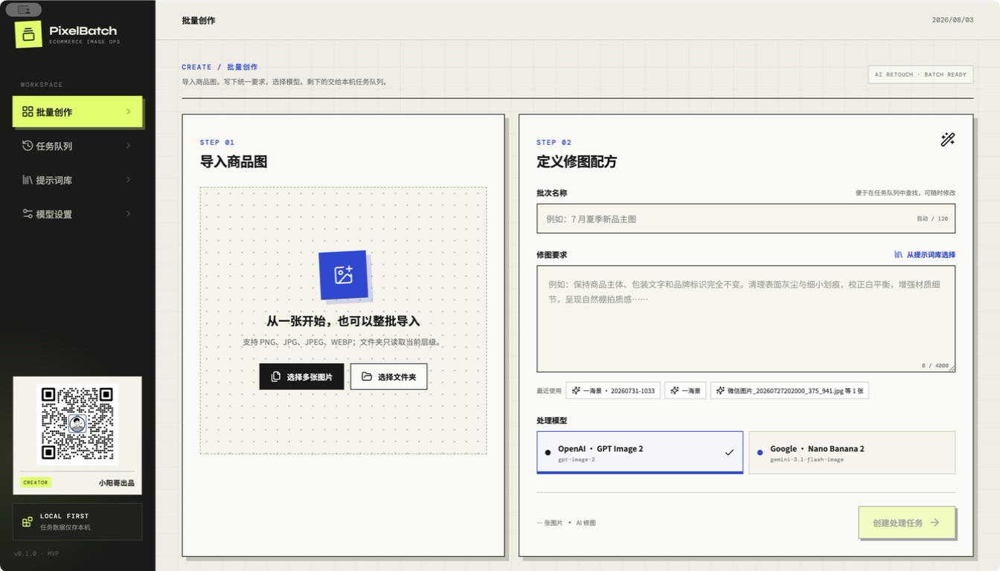
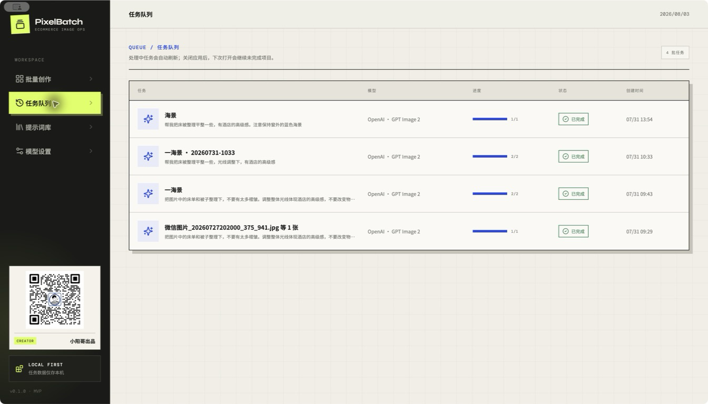
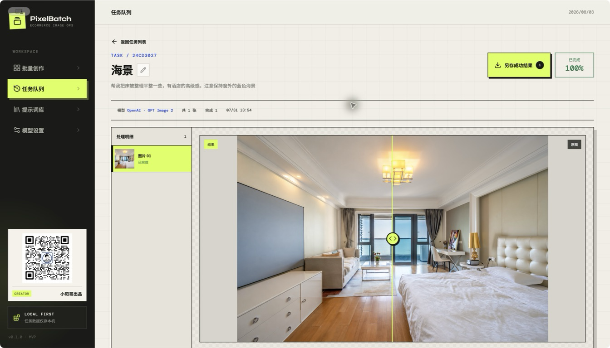
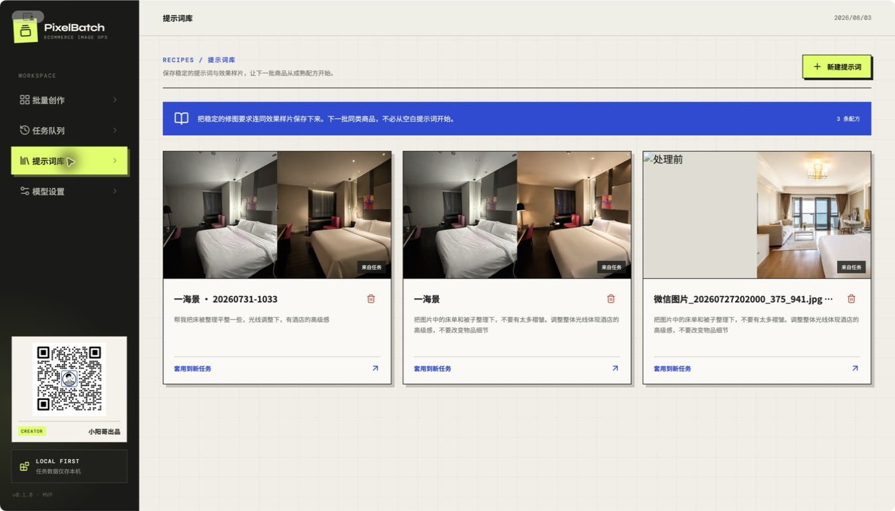

# PixelBatch

[阅读完整功能介绍与使用场景](docs/wechat/pixelbatch-tool/pixelbatch-wechat-article.md)

PixelBatch 是面向电商运营与视觉团队的本地优先 AI 图片批处理桌面应用。当前 MVP 聚焦一条完整、可验证的主链路：

> 导入商品图 → 套用或编写修图提示词 → 选择图片模型 → 批量处理 → 查看任务进度 → 前后对比 → 把好用的提示词和样片沉淀为配方

## 下载地址
- Windows：https://my.feishu.cn/file/NbfdbTNRKoYbUIx7KgzcRIaknre

- MacOS：https://my.feishu.cn/file/ZTyqbLEd7oR4PhxLRWjcSRQanHc

## 界面预览

<table>
  <tr>
    <td width="50%" align="center">
      
      <br>
      <sub>批量创作：导入图片、填写提示词并选择模型</sub>
    </td>
    <td width="50%" align="center">
      
      <br>
      <sub>任务队列：按批次查看进度和状态</sub>
    </td>
  </tr>
  <tr>
    <td width="50%" align="center">
      
      <br>
      <sub>任务详情：前后对比、查看大图和批量另存</sub>
    </td>
    <td width="50%" align="center">
      
      <br>
      <sub>提示词库：保存提示词和前后对比样片</sub>
    </td>
  </tr>
</table>

## 当前能力

* 单张、多张、文件夹导入（PNG / JPG / JPEG / WEBP）
* AI 修图批任务，同一批次内最多 2 张图片同时处理
* OpenAI GPT Image 2（`gpt-image-2`）
* Google Nano Banana 2（`gemini-3.1-flash-image`）
* 模型 URL、API Key、模型名、启用状态和默认模型可配置，可先测试连接
* 任务列表、子项状态、失败信息、失败项重试、取消尚未开始的图片
* 完成结果的拖动式前后对比与本地文件定位
* 结果大图查看，支持缩放、拖动、旋转与适应窗口
* 将任务内所有成功结果批量另存到指定目录，同名文件自动安全重命名
* 从任务结果保存提示词 + 前后样片
* 手动保存提示词 + 封面图
* SQLite 本地持久化；API Key 优先使用 Electron `safeStorage` 加密
* 异常退出恢复：处理中项目重置为等待状态

## 产品边界

当前版本只把 **AI 修图** 做成真实调用链路。抠图和换背景已作为后续能力纳入信息架构，但没有用占位逻辑伪装为可用功能。建议后续按以下顺序演进：

1. 增加可配置的并发数，以及单张预估成本。
2. 暂停后从中断处继续，而不是只取消未开始的图片。
3. 实现智能抠图 provider，并支持透明 PNG 输出。
4. 实现换背景工作流：背景模板、阴影策略、画布比例和安全区。
5. 增加批次级导出、命名规则、商品 SKU 映射。
6. 增加多轮精修版本树，而不是覆盖已有结果。

## 技术架构

```text
React Renderer
    ├── Electron：typed IPC
    └── Web：HTTP /api（npm run dev:web）
            │
Shared core
    ├── SQLite
    ├── TaskRunner（queue / recovery / retry）
    └── ImageProvider（OpenAI / Gemini）
```

Web 版复用同一套数据库、任务队列和模型适配器。浏览器通过本机 HTTP 接口访问，不启动 Electron 窗口。

任务系统只依赖统一的 `ImageProvider.edit()` 接口。接入新的图片服务时，实现该接口并在 provider factory 注册即可，任务、提示词库和结果页都不需要修改。

## 本地运行

要求 Node.js 22+。

桌面版：

```bash
npm install
npm run dev
```

Web 版（浏览器，不打开 Electron 窗口）：

```bash
npm install
npm run dev:web
```

浏览器打开 http://127.0.0.1:5180 。端口可用 `PIXELBATCH_WEB_PORT` 修改，数据目录可用 `PIXELBATCH_DATA_DIR` 修改。设置 `PIXELBATCH_NO_OPEN=1` 时不自动打开浏览器。

打开“模型设置”，为至少一个模型配置 API Key，然后回到“批量创作”创建任务。Web 版选择图片时，文件会先上传到本机服务，再进入同一套任务队列。

## 验证

```bash
npm run typecheck
npm test
npm run build
```

## 打包

```bash
npm run package
```

Electron Builder 会在 `release/` 生成当前操作系统对应的安装包。若要正式分发，还需补充应用图标、macOS/Windows 代码签名和自动更新配置。

## 数据位置

* 桌面版 SQLite：Electron `userData` 目录下的 `pixelbatch.sqlite`
* 桌面版处理结果：系统“图片”目录下的 `PixelBatch/<task-id>/`
* Web 版数据：项目目录 `data/web/`（`pixelbatch.sqlite`、`uploads/`、`output/`、`exports/`），与桌面版分开保存。Web 版的 API Key 存在这个数据库里，不使用系统钥匙串
* 原图：桌面版只读，不覆盖、不移动。Web 版会把选中的图片复制到 `uploads/`

删除提示词只删除数据库记录，不会删除原图或任务结果。删除任务会移除任务记录，并删除未被提示词库引用的处理结果；原图和处理中的任务都会保留。模型可以删除，已完成的任务仍保留当时的模型名称；正在处理中的任务引用该模型时，需要等它结束后再删。
