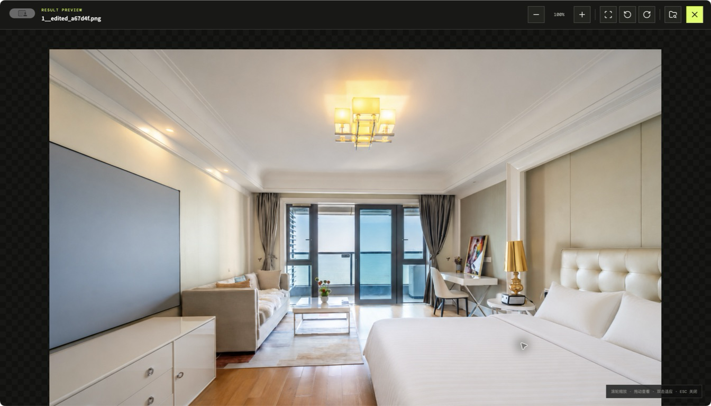
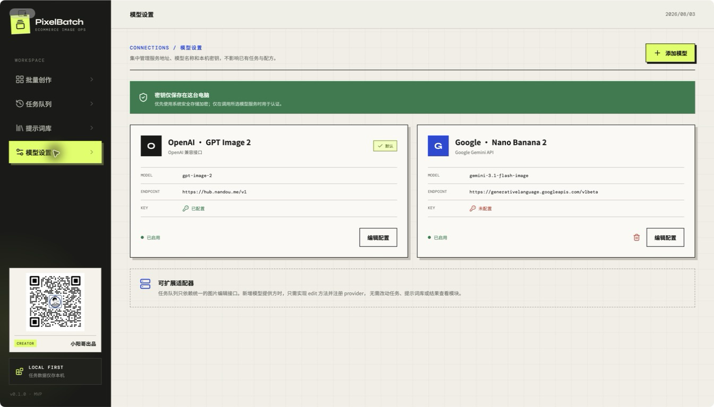

做电商图片时，最麻烦的常常不是修某一张图，而是同样的操作要做很多遍：上传、写提示词、等结果、检查细节，再一张张保存。

最近我把这些操作做成了一个桌面工具，叫 PixelBatch。它可以批量导入商品图，统一提交给图片模型处理，再集中查看和导出结果。

项目地址：[GitHub - towardsyoung/pixelbatch](https://github.com/towardsyoung/pixelbatch)

## 现在能做什么

* 导入一张、多张图片，或者直接导入整个文件夹。
* 给任务起一个容易记的批次名。文件夹导入会默认使用文件夹名，重名时自动加后缀。
* 编写修图要求，或者直接套用以前保存过的提示词。
* 选择 OpenAI GPT Image 2、Google Nano Banana 2，也可以自己配置接口地址、API Key 和模型名称。
* 在任务列表里看进度，失败的图片可以单独重试。
* 查看处理前后对比，放大检查细节，并把成功结果批量另存到指定文件夹。

*批量创作：导入图片、填写批次名、输入提示词并选择模型。*

## 批量任务不用一直盯着

每次提交都会生成一个任务批次。任务列表会显示图片数量、完成进度和当前状态。即使同时处理多组商品图，也不容易弄混。

*任务队列：按批次查看处理进度。*

点进任务后，可以逐张看原图和结果图。顶部的“另存成功结果”会把这一批已经完成的图片一次导出，不用逐张下载。

*任务详情：前后对比、查看大图、定位文件和保存提示词。*

需要检查纹理、边缘或画面细节时，可以打开大图查看器。它支持缩放、拖动、旋转和适应窗口。

*大图查看器：适合在导出前做最后一次检查。*

## 好用的提示词可以留下来

我不太想每次都从聊天记录里翻提示词，所以单独做了一个提示词库。

某次修图效果不错，可以把提示词连同处理前后的图片一起保存。下次遇到相似商品，先套用旧配方，再改几个细节就行。也可以手动添加提示词和封面图。

*提示词库会保留提示词和效果图，也可以直接套用到新任务。*

## 模型可以自己配置

目前内置了 OpenAI GPT Image 2 和 Google Nano Banana 2。模型设置里可以修改接口地址、API Key、模型名称和默认模型，后面接其他图片服务时，不需要重做任务和结果页面。

API Key 保存在本机，原图也不会被覆盖或移动。

*模型设置：管理模型地址、名称和启用状态。*

## 哪些情况比较适合

* 同款商品有多张角度图，需要统一背景、光线或画面风格。
* 家居、床品等商品需要批量调整场景，但要保留材质和产品结构。
* 活动上新时，需要一次处理多组商品图。
* 经常重复使用同一类修图要求，想把提示词和样片整理起来。

第一次使用时，建议先拿 1～2 张图片测试。效果符合预期，再提交整个文件夹。

## 目前的边界

当前版本先把 AI 修图做完整。抠图和换背景已经放进后续计划，但还没有作为可用功能发布。

图片处理会调用第三方模型接口，因此仍会受到接口额度、速度和内容规则的影响。AI 结果也需要人工检查，尤其是商品结构、材质纹理、文字和 Logo。

PixelBatch 使用 Electron、React、TypeScript 和 SQLite 开发，代码和构建方式都放在 GitHub：

<https://github.com/towardsyoung/pixelbatch>
